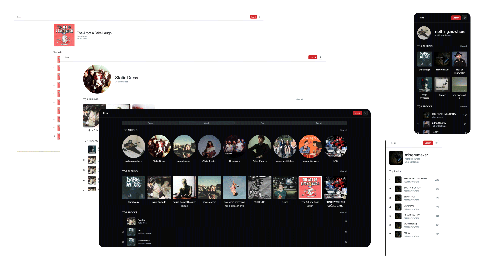

# Yhar

> [!WARNING]
> This project is still in under heavy development and not ready be used by anyone else. It's not complete and nothing is made easy for others to use.

# What it is

Yhar is selfhosted scrobbler & scrobble database.

# Features

- Scrobble music from Navidrome
- Muscibrainz's metadata
- Also handle unrecognized tracks (unreleased, custom EP, etc.)
- Import data from old sources (Maloja only for now)
- Stats dashboard
    - Top artists, albums, tracks
    - Scrobble history
    - Filter by date, artists & albums

## Roadmap

No roadmap yet, just a list of issues and random draft ideas.

# Technical details

Monorepo with 2 main packages:

- [Server](./internal) backend server, written in Go with Gin & Gorm.
- [Web](./web) frontend, written in TypeScript with SvelteKit, ShadcnUI and Vite.

# Why does it exist

I left Spotify and all streaming platforms in 2025. I switched to a
self-hosted [Navidrome](https://github.com/navidrome/navidrome) on my own server (more info about whole the
setup [here](https://github.com/rangodisco/homelab)).
I still wanted to keep track of my listening habits and wasn't satisfied with the existing solutions.
